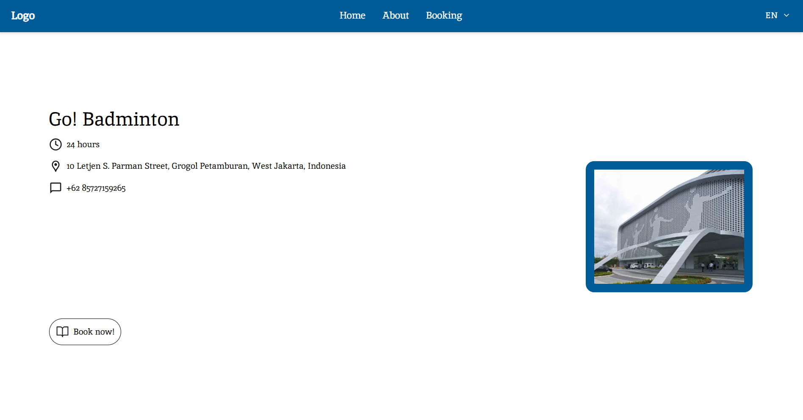

# 🏸 Go! Badminton


🏸 **Go! Badminton** is a modern and responsive **badminton court booking platform** built using **Next.js** and **Tailwind CSS**.  
It features a complete **internationalization (i18n)** system that allows users to easily toggle between **Indonesian (ID)** and **English (EN)**, creating an accessible experience for local and global audiences.

---

## 🖼️ Project Preview


---
## ✨ Core Features
- 🌐 **Internationalization (i18n)** — Full support for two languages (English & Indonesian) using React Context and `localStorage`.
- 🎨 **Responsive Design** — Built mobile-first with Tailwind CSS for seamless display on all devices.
- 🧱 **Component Architecture** — Clean, modular folder structure separating layouts, sections, and UI components.
- 🎠 **Drag-to-Scroll Carousel** — A custom `useDragScroll` hook for smooth horizontal court review scrolling.
- ♿ **Accessible Language Switcher** — Custom dropdown built using Headless UI, fully stylable and keyboard-accessible.
- 🧭 **Reusable Layout System** — Includes NavBar and Footer integrated through Next.js App Router.
- ⚡ **Fast Development Experience** — TypeScript ensures type safety and a clean development workflow.
---

## 🚀 Getting Started Go! Badminton in Local

### 1. Clone Repository
```bash
git clone https://github.com/BoviliusMeidi/go-badminton.git
cd go-badminton
```
### 2. Install Dependencies
```bash
npm install
# or
yarn install
```
### 3. Run Development Server
```bash
npm run dev
# or
yarn dev
```
### 4. Open in Browser
```bash
http://localhost:3000
```

---
## 📜 License & Acknowledgements

This project was built for portfolio and educational purposes and is licensed under the **MIT License**.
Feel free to fork, modify, and use the code. Attribution is appreciated! 🙌

---
## 👨‍💻 Author
Built by 
- [Bovilius Meidi](https://github.com/BoviliusMeidi) 😎
- [Khenichi Kuolimpo](https://github.com/kenycheee)